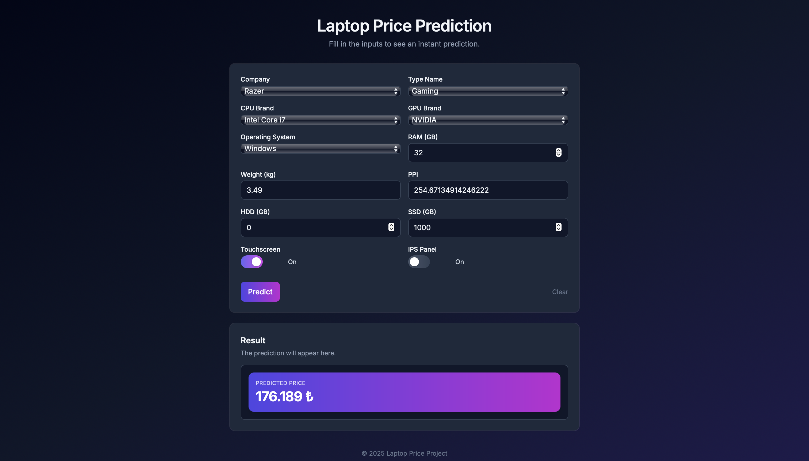

# Laptop Price ML Deployment

A preview of the deployed web application 👇  

> 📸 *Users can input laptop specifications such as RAM, CPU type, GPU, and storage — and instantly receive a predicted price.*

---

## 🧠 Overview
A machine learning web application that predicts **laptop prices** based on their hardware specifications such as RAM, CPU, GPU, and storage.  
This project demonstrates both **model development** and **deployment** using FastAPI, allowing real-time predictions through a simple and clean web interface.

---

## ⚙️ Tech Stack
- **Python** – Data processing & model training  
- **scikit-learn** – Machine learning and evaluation  
- **FastAPI** – Backend for serving predictions  
- **Jinja2 & HTML** – Web interface templates  
- **pickle** – Model serialization and loading  

---

## 🧠 Model Details
- **Algorithm:** Support Vector Regressor (SVR)  
- **Dataset:** Laptop Price Dataset (Kaggle)  
- **Target Variable:** Price  
- **Evaluation Metrics:**  
  - R² Score → 0.86 
- **Preprocessing:** Label Encoding + StandardScaler  
- **Purpose:** Estimate laptop price based on user-provided specifications.

---

## 🧩 How to Run Locally
1. **Clone the repository**  
   Run the following command in your terminal:  
   `git clone https://github.com/burakkyildiz/LaptopPrice-MLDeployment.git`

2. **Navigate into the project folder**  
   `cd LaptopPrice-MLDeployment`

3. **Install dependencies**  
   Install all required packages with:  
   `pip install -r requirements.txt`

4. **Run the FastAPI app**  
   Start the local development server using:  
   `uvicorn app:app --reload`

5. **Open the application**  
   Visit the following address in your browser:  
   [http://127.0.0.1:8000](http://127.0.0.1:8000)

---

## 🧭 Future Improvements
- Store user inputs and predictions in a database  
- Making the interface **responsive** (mobile compatible)

---

## 🪪 Author
**Burak Yıldız**  
[GitHub](https://github.com/burakkyildiz) · [Kaggle](https://www.kaggle.com/burakkyildiz) · [LinkedIn](https://www.linkedin.com/in/burakkyildiz/)

---

💡 *This project was created as part of my Machine Learning Engineering learning journey to practice model training, evaluation, and deployment.*
